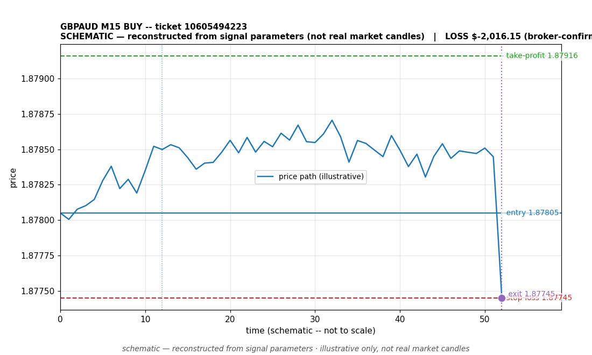

# GBPAUD BUY -- ticket 10605494223

**Status:** CLOSED — LOSS (broker-confirmed)
**Date:** 2026-09-21 (MT5 server time (UTC+3))

## Trade facts

- Symbol: GBPAUD
- Direction: BUY
- Timeframe: M15
- Entry time: 2026.09.21 23:30:28 (MT5 server time (UTC+3))
- Exit time: 2026.09.22 00:00:43
- Entry price: 1.87805
- Exit price: 1.87745
- Stop-loss: 1.87745
- Take-profit: 1.87916
- Volume: 35 lots
- P&L: $-2,016.15 (broker-confirmed net)
- Floating P&L: not recorded
- Commission / swap: commission=0, swap=-520.74
- Exit reason: broker-sl — broker-confirmed
- Market session at entry: New York

## Signal rationale

strategy `ema_rsi`: EMA20 crossed above EMA50, RSI=65.1 (RSI=65.1, EMA20=1.87732, EMA50=1.87729, ATR=0.00038, candle: 2026.09.21 23:15:00)

## Gate decision record

decision: `commanded`; volume: 35.0; planned risk: $5,000.00; time: 2026-09-21 20:29:59

## Why loss — broker-confirmed

- Broker-confirmed loss: the trade hit its stop-loss (1.87745). Exit price 1.87745 matches the SL, so the position was stopped out as designed by the risk plan.
- Entry 1.87805 -> SL 1.87745: price moved against the buy position immediately; the EMA-cross signal did not follow through.
- Commission 0, swap -520.74 (included in the confirmed net figure).
- Data warning: the recorded close time (2026.09.21 21:00:42) is earlier than the recorded open time (2026.09.21 23:30:28). One of the timestamps is wrong; treat the timing as unreliable.

## Chart

_Chart is schematic -- reconstructed from the signal's entry/SL/TP/exit parameters. No historical candle data is stored in this environment, so this is an illustration of the trade plan, not real market candles._

## Data gaps / notes

- Supersedes the provisional -1495.22 close: broker shows swap -520.74, net -2016.15.

---
_Generated by trade_report.py for the 30-day autonomous demo trading experiment. Demo account, no real money._
