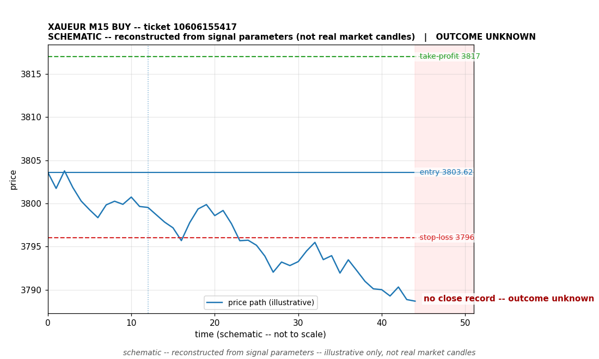

# XAUEUR BUY -- ticket 10606155417

**Status:** OUTCOME UNKNOWN -- under reconciliation
**Date:** 2026-09-22 (MT5 server time (UTC+3))

## Trade facts

- Symbol: XAUEUR
- Direction: BUY
- Timeframe: M15
- Entry time: 2026.09.22 02:15:01 (MT5 server time (UTC+3))
- Exit time: not recorded
- Entry price: 3803.62
- Exit price: not recorded
- Stop-loss: 3796
- Take-profit: 3817
- Volume: 1 lots
- P&L: not recorded
- Floating P&L: not recorded
- Commission / swap: not recorded
- Exit reason: not recorded
- Market session at entry: Asian (Sydney/Tokyo)

## Signal rationale

strategy `ema_rsi`: EMA20 crossed above EMA50, RSI=64.6 (RSI=64.6, EMA20=3793.8, EMA50=3793.33, ATR=4.67, candle: 2026.09.22 02:00:00)

## Gate decision record

decision: `commanded`; volume: 1.0; planned risk: $9,973.79; time: 2026-09-21 16:15:01

## Why this is unresolved

- Outcome unknown -- no clean close record exists for this ticket. The position is absent from the latest broker open-positions snapshot without a recorded close event. It is under reconciliation; no profit or loss is claimed.
- This ticket was already flagged as a known reconciliation gap on 2026-09-22.

## Chart

_Chart is schematic -- reconstructed from the signal's entry/SL/TP/exit parameters. No historical candle data is stored in this environment, so this is an illustration of the trade plan, not real market candles._

## Data gaps / notes

- No close event recorded -- outcome unknown, under reconciliation.

---
_Generated by trade_report.py for the 30-day autonomous demo trading experiment. Demo account, no real money._
