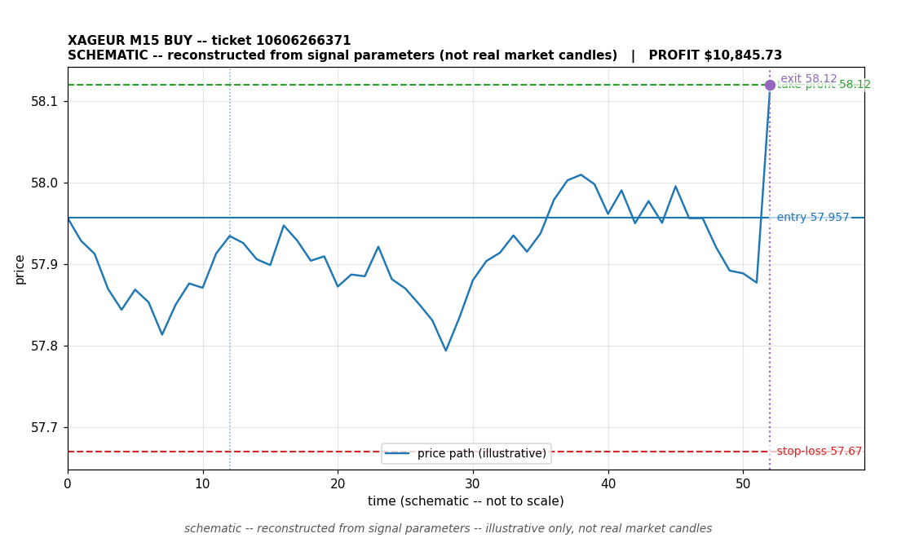

# XAGEUR BUY -- ticket 10606266371

**Status:** CLOSED -- PROFIT
**Date:** 2026-09-22 (MT5 server time (UTC+3))

## Trade facts

- Symbol: XAGEUR
- Direction: BUY
- Timeframe: M15
- Entry time: 2026.09.22 02:33:42 (MT5 server time (UTC+3))
- Exit time: 2026.09.22 02:58:01
- Entry price: 57.957
- Exit price: 58.12
- Stop-loss: 57.67
- Take-profit: 58.12
- Volume: 58.04 lots
- P&L: $10,845.73
- Floating P&L: not recorded
- Commission / swap: not recorded
- Exit reason: take-profit close (broker-confirmed)
- Market session at entry: Asian (Sydney/Tokyo)

## Signal rationale

strategy `ema_rsi`: EMA20 crossed above EMA50, RSI=59.1 (RSI=59.1, EMA20=57.679, EMA50=57.675, ATR=0.1, candle: 2026.09.22 02:15:00)

## Gate decision record

decision: `skipped:max_total_exposure`; time: 2026-09-21 16:30:03

## Why profit

- Profit: the trade reached its take-profit target (58.12). Exit price 58.12 matches the TP set on the signal, so the broker closed it as a winner.
- It was held 1459 seconds (~24 min) -- a fast move in the signal's direction after entry.
- Commission/swap: not recorded.
- Context: this fill was a MANUAL OVERRIDE -- the owner ordered the fill after the executor had skipped the signal (skipped:max_total_exposure). The win came from a human override, not from the autonomous decision path.

## Chart

_Chart is schematic -- reconstructed from the signal's entry/SL/TP/exit parameters. No historical candle data is stored in this environment, so this is an illustration of the trade plan, not real market candles._

## Data gaps / notes

- None -- all key fields recorded.

---
_Generated by trade_report.py for the 30-day autonomous demo trading experiment. Demo account, no real money._
