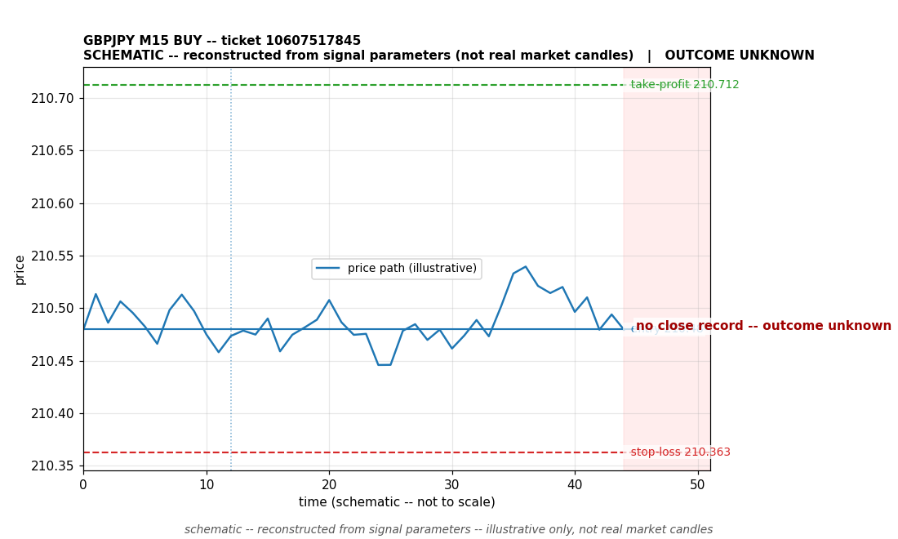

# GBPJPY BUY -- ticket 10607517845

**Status:** OUTCOME UNKNOWN -- under reconciliation
**Date:** 2026-09-22 (MT5 server time (UTC+3))

## Trade facts

- Symbol: GBPJPY
- Direction: BUY
- Timeframe: M15
- Entry time: 2026.09.22 04:45:05 (MT5 server time (UTC+3))
- Exit time: not recorded
- Entry price: 210.48
- Exit price: not recorded
- Stop-loss: 210.363
- Take-profit: 210.712
- Volume: 136.84 lots
- P&L: not recorded
- Floating P&L: not recorded
- Commission / swap: not recorded
- Exit reason: not recorded
- Market session at entry: Asian (Sydney/Tokyo) / Tokyo

## Signal rationale

strategy `ema_rsi`: EMA20 crossed above EMA50, RSI=54.7 (RSI=54.7, EMA20=210.418, EMA50=210.415, ATR=0.078, candle: 2026.09.22 04:30:00)

## Gate decision record

decision: `commanded`; volume: 136.84; planned risk: $10,078.40; time: 2026-09-21 18:45:04

## Why this is unresolved

- Outcome unknown -- no clean close record exists for this ticket. The position is absent from the latest broker open-positions snapshot without a recorded close event. It is under reconciliation; no profit or loss is claimed.
- This ticket was already flagged as a known reconciliation gap on 2026-09-22.

## Chart

_Chart is schematic -- reconstructed from the signal's entry/SL/TP/exit parameters. No historical candle data is stored in this environment, so this is an illustration of the trade plan, not real market candles._

## Data gaps / notes

- No close event recorded -- outcome unknown, under reconciliation.

---
_Generated by trade_report.py for the 30-day autonomous demo trading experiment. Demo account, no real money._
