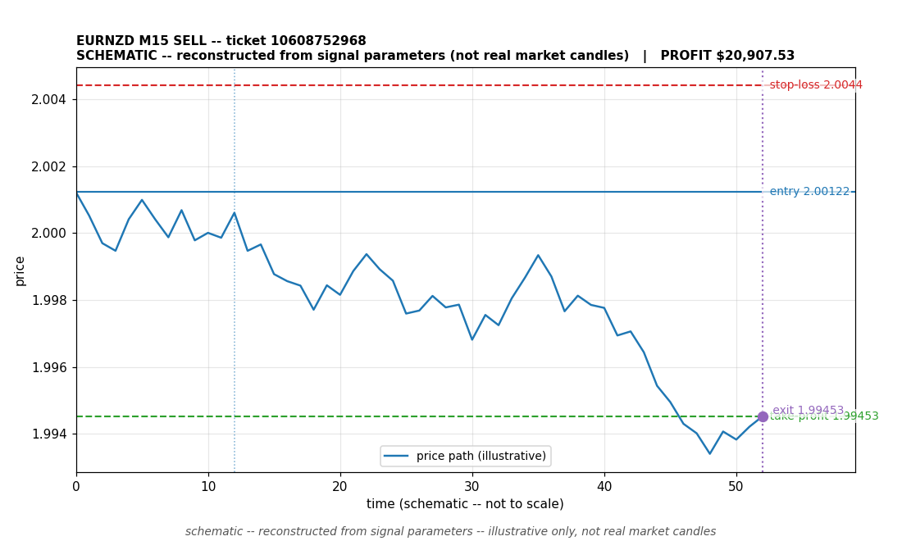

# EURNZD SELL -- ticket 10608752968

**Status:** CLOSED -- PROFIT
**Date:** 2026-09-22 (MT5 server time (UTC+3))

## Trade facts

- Symbol: EURNZD
- Direction: SELL
- Timeframe: M15
- Entry time: 2026.09.22 06:45:03 (MT5 server time (UTC+3))
- Exit time: 2026-09-22 11:53:30
- Entry price: 2.00122
- Exit price: 1.99453
- Stop-loss: 2.0044
- Take-profit: 1.99453
- Volume: 54.48 lots
- P&L: $20,907.53
- Floating P&L: not recorded
- Commission / swap: not recorded
- Exit reason: take_profit
- Market session at entry: Asian (Sydney/Tokyo) / Tokyo

## Signal rationale

strategy `ema_rsi`: EMA20 crossed below EMA50, RSI=30.2 (RSI=30.2, EMA20=2.00603, EMA50=2.00617, ATR=0.00219, candle: 2026.09.22 06:30:00)

## Gate decision record

decision: `commanded`; volume: 54.48; planned risk: $10,277.71; time: 2026-09-22 03:45:02

## Why profit

- Profit of $20,907.53; close reason recorded as 'take_profit'. The precise cause of this outcome is unclear from the recorded fields.
- Commission/swap: not recorded.

## Chart

_Chart is schematic -- reconstructed from the signal's entry/SL/TP/exit parameters. No historical candle data is stored in this environment, so this is an illustration of the trade plan, not real market candles._

## Data gaps / notes

- Broker-confirmed close: deal #<redacted> buy 54.48 EURNZD @ 1.99453 (order #<redacted>). Exit exactly at TP 1.99453. Computed P&L $20,907.53 matches last observed floating +$20,981.85 within 0.4%. | backfilled 2026-09-22 from reconciled DB

---
_Generated by trade_report.py for the 30-day autonomous demo trading experiment. Demo account, no real money._
