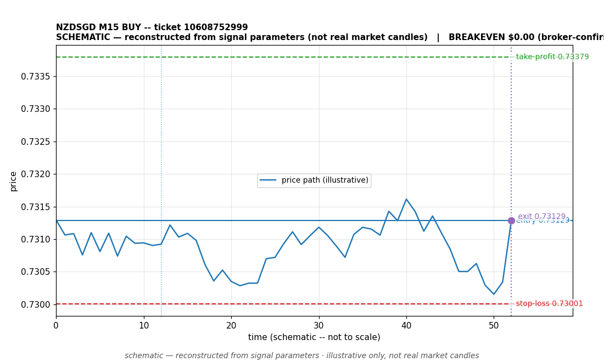

# NZDSGD BUY -- ticket 10608752999

**Status:** CLOSED — BREAKEVEN (broker-confirmed)
**Date:** 2026-09-22 (MT5 server time (UTC+3))

## Trade facts

- Symbol: NZDSGD
- Direction: BUY
- Timeframe: M15
- Entry time: 2026.09.22 06:45:03 (MT5 server time (UTC+3))
- Exit time: 2026.09.22 10:59:30
- Entry price: 0.73129
- Exit price: 0.73129
- Stop-loss: 0.73001
- Take-profit: 0.73379
- Volume: 100 lots
- P&L: $0.00 (broker-confirmed net)
- Floating P&L: not recorded
- Commission / swap: commission=0, swap=0
- Exit reason: broker-sl — broker-confirmed
- Market session at entry: Asian (Sydney/Tokyo) / Tokyo

## Signal rationale

strategy `ema_rsi`: EMA20 crossed above EMA50, RSI=68.3 (RSI=68.3, EMA20=0.72939, EMA50=0.72935, ATR=0.00084, candle: 2026.09.22 06:30:00)

## Gate decision record

decision: `commanded`; volume: 100.0; planned risk: $10,277.71; time: 2026-09-22 03:45:02

## Why breakeven — broker-confirmed

- Broker-confirmed breakeven: authoritative net P&L is exactly $0.00 (gross, commission and swap accounted).
- Commission 0, swap 0 (included in the confirmed net figure).
- Data warning: the recorded close time (2026-09-22 04:06:03) is earlier than the recorded open time (2026.09.22 06:45:03). One of the timestamps is wrong; treat the timing as unreliable.

## Chart

_Chart is schematic -- reconstructed from the signal's entry/SL/TP/exit parameters. No historical candle data is stored in this environment, so this is an illustration of the trade plan, not real market candles._

## Data gaps / notes

- EA missed the close across terminal restarts; backfilled from broker deal history. No figures estimated.

---
_Generated by trade_report.py for the 30-day autonomous demo trading experiment. Demo account, no real money._
