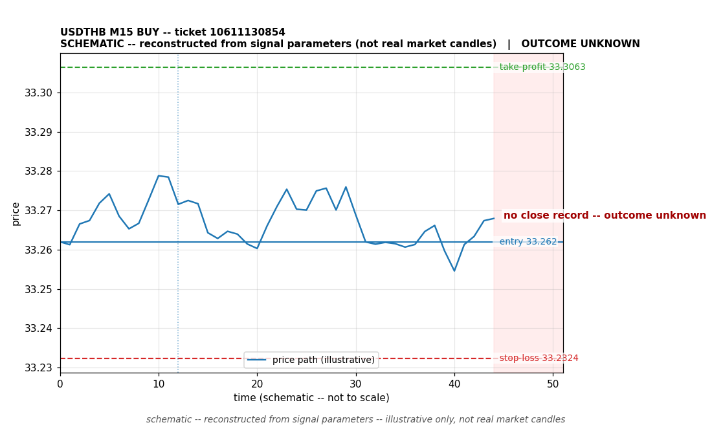

# USDTHB BUY -- ticket 10611130854

**Status:** OUTCOME UNKNOWN -- under reconciliation
**Date:** 2026-09-22 (MT5 server time (UTC+3))

## Trade facts

- Symbol: USDTHB
- Direction: BUY
- Timeframe: M15
- Entry time: 2026.09.22 09:30:04 (MT5 server time (UTC+3))
- Exit time: not recorded
- Entry price: 33.262
- Exit price: not recorded
- Stop-loss: 33.2324
- Take-profit: 33.3063
- Volume: 170.01 lots
- P&L: not recorded
- Floating P&L: not recorded
- Commission / swap: not recorded
- Exit reason: not recorded
- Market session at entry: Tokyo

## Signal rationale

strategy `ema_rsi`: EMA20 crossed above EMA50, RSI=55.8 (RSI=55.8, EMA20=33.2449, EMA50=33.2449, ATR=0.0164, candle: 2026.09.22 09:15:00)

## Gate decision record

decision: `commanded`; volume: 170.01; planned risk: $12,573.09; time: 2026-09-22 06:30:03

## Why this is unresolved

- No close recorded yet -- this trade opened after the latest positions snapshot, so its current open/closed status is unconfirmed. Nothing is claimed about its outcome.

## Chart

_Chart is schematic -- reconstructed from the signal's entry/SL/TP/exit parameters. No historical candle data is stored in this environment, so this is an illustration of the trade plan, not real market candles._

## Data gaps / notes

- No close event recorded -- outcome unknown, under reconciliation.

---
_Generated by trade_report.py for the 30-day autonomous demo trading experiment. Demo account, no real money._
