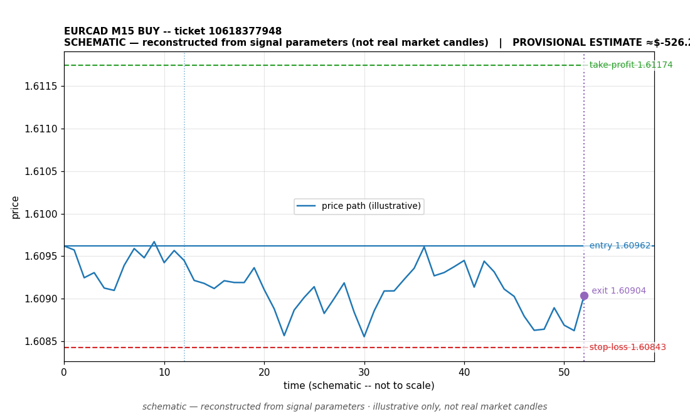

# EURCAD BUY -- ticket 10618377948

**Status:** CLOSED — PROVISIONAL ESTIMATE (unconfirmed)
**Date:** 2026-09-22 (MT5 server time (UTC+3))

## Trade facts

- Symbol: EURCAD
- Direction: BUY
- Timeframe: M15
- Entry time: 2026.09.22 15:00:04 (MT5 server time (UTC+3))
- Exit time: 2026.09.22 17:57:48
- Entry price: 1.60962
- Exit price: 1.60904
- Stop-loss: 1.60843
- Take-profit: 1.61174
- Volume: 12.76 lots
- P&L: $-526.26 (provisional estimate — excludes commission/swap; NOT broker-confirmed)
- Floating P&L: not recorded
- Commission / swap: commission=0, swap=0
- Exit reason: command — provisional (unconfirmed)
- Market session at entry: London / New York

## Signal rationale

strategy `ema_rsi`: EMA20 crossed above EMA50, RSI=60.9 (RSI=60.9, EMA20=1.60864, EMA50=1.60862, ATR=0.00074, candle: 2026.09.22 14:45:00)

## Gate decision record

decision: `commanded`; volume: 12.76; planned risk: $1,000.00; time: 2026-09-22 12:00:02

## Why this is only a provisional estimate

- This close is a PROVISIONAL ESTIMATE, not a broker-confirmed result. No profit or loss is claimed for this trade; any figure shown is for context only.
- Basis: close reason 'command'.
- Commission/swap: not recorded -- excluded from the estimate.

## Chart

_Chart is schematic -- reconstructed from the signal's entry/SL/TP/exit parameters. No historical candle data is stored in this environment, so this is an illustration of the trade plan, not real market candles._

## Data gaps / notes

- Close is a provisional estimate -- not broker-confirmed; excluded from the realized P&L total.

---
_Generated by trade_report.py for the 30-day autonomous demo trading experiment. Demo account, no real money._
