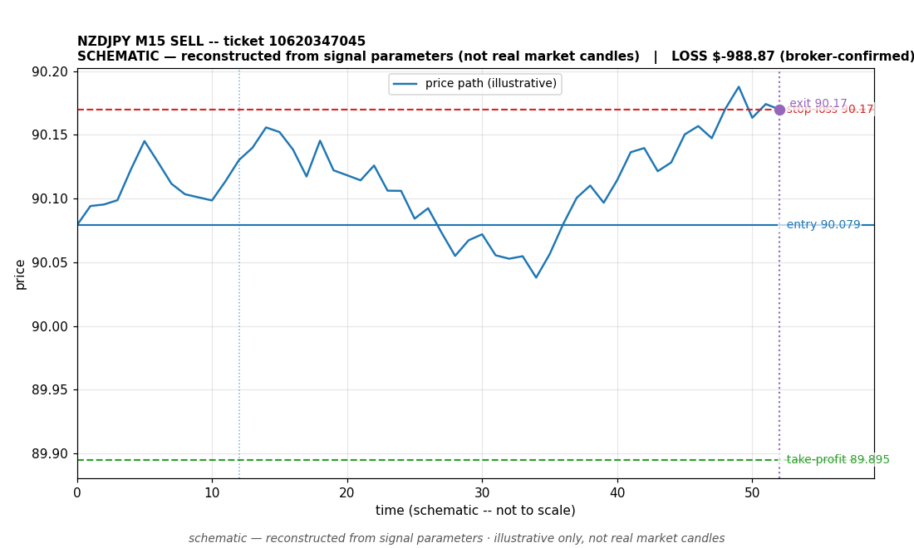

# NZDJPY SELL -- ticket 10620347045

**Status:** CLOSED — LOSS (broker-confirmed)
**Date:** 2026-09-22 (MT5 server time (UTC+3))

## Trade facts

- Symbol: NZDJPY
- Direction: SELL
- Timeframe: M15
- Entry time: 2026.09.22 16:16:00 (MT5 server time (UTC+3))
- Exit time: 2026.09.22 16:47:41
- Entry price: 90.079
- Exit price: 90.17
- Stop-loss: 90.17
- Take-profit: 89.895
- Volume: 17.09 lots
- P&L: $-988.87 (broker-confirmed net)
- Floating P&L: not recorded
- Commission / swap: commission=0, swap=0
- Exit reason: broker-recorded close — broker-confirmed
- Market session at entry: London / New York

## Signal rationale

strategy `ema_rsi`: EMA20 crossed below EMA50, RSI=42.1 [re-presented 2026.09.22 16:15:52 after direction-aware correlation-gate fix; original NZDJPY_M15_SELL_1790090100 was wrongfully skipped:correlated_position] (RSI=42.1, EMA20=90.16, EMA50=90.161, ATR=0.061, candle: 2026.09.22 15:15:00)

## Gate decision record

decision: `commanded`; volume: 17.09; planned risk: $1,000.00; time: 2026-09-22 06:15:59

## Why loss — broker-confirmed

- Broker-confirmed loss: the trade hit its stop-loss (90.17). Exit price 90.17 matches the SL, so the position was stopped out as designed by the risk plan.
- Entry 90.079 -> SL 90.17: price moved against the sell position immediately; the EMA-cross signal did not follow through.
- Commission 0, swap 0 (included in the confirmed net figure).

## Chart

_Chart is schematic -- reconstructed from the signal's entry/SL/TP/exit parameters. No historical candle data is stored in this environment, so this is an illustration of the trade plan, not real market candles._

## Data gaps / notes

- None -- all key fields recorded.

---
_Generated by trade_report.py for the 30-day autonomous demo trading experiment. Demo account, no real money._
