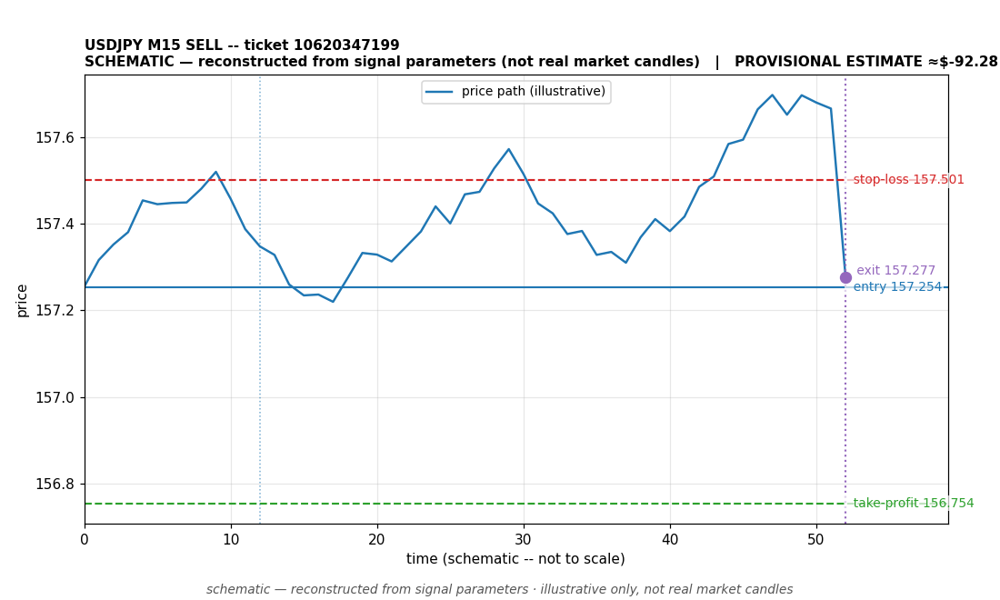

# USDJPY SELL -- ticket 10620347199

**Status:** CLOSED — PROVISIONAL ESTIMATE (unconfirmed)
**Date:** 2026-09-22 (MT5 server time (UTC+3))

## Trade facts

- Symbol: USDJPY
- Direction: SELL
- Timeframe: M15
- Entry time: 2026.09.22 16:16:00 (MT5 server time (UTC+3))
- Exit time: 2026.09.22 17:57:49
- Entry price: 157.254
- Exit price: 157.277
- Stop-loss: 157.501
- Take-profit: 156.754
- Volume: 6.31 lots
- P&L: $-92.28 (provisional estimate — excludes commission/swap; NOT broker-confirmed)
- Floating P&L: not recorded
- Commission / swap: commission=0, swap=0
- Exit reason: command — provisional (unconfirmed)
- Market session at entry: London / New York

## Signal rationale

strategy `ema_rsi`: EMA20 crossed below EMA50, RSI=32.4 [re-presented 2026.09.22 16:15:52 after direction-aware correlation-gate fix; original USDJPY_M15_SELL_1790080200 was wrongfully skipped:correlated_position] (RSI=32.4, EMA20=157.423, EMA50=157.438, ATR=0.166, candle: 2026.09.22 12:30:00)

## Gate decision record

decision: `commanded`; volume: 6.31; planned risk: $1,000.00; time: 2026-09-22 06:15:59

## Why this is only a provisional estimate

- This close is a PROVISIONAL ESTIMATE, not a broker-confirmed result. No profit or loss is claimed for this trade; any figure shown is for context only.
- Basis: close reason 'command'.
- Commission/swap: not recorded -- excluded from the estimate.

## Chart

_Chart is schematic -- reconstructed from the signal's entry/SL/TP/exit parameters. No historical candle data is stored in this environment, so this is an illustration of the trade plan, not real market candles._

## Data gaps / notes

- Close is a provisional estimate -- not broker-confirmed; excluded from the realized P&L total.

---
_Generated by trade_report.py for the 30-day autonomous demo trading experiment. Demo account, no real money._
