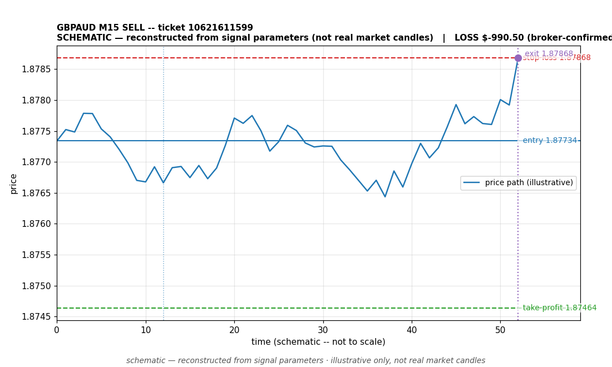

# GBPAUD SELL -- ticket 10621611599

**Status:** CLOSED — LOSS (broker-confirmed)
**Date:** 2026-09-22 (MT5 server time (UTC+3))

## Trade facts

- Symbol: GBPAUD
- Direction: SELL
- Timeframe: M15
- Entry time: 2026.09.22 17:00:00 (MT5 server time (UTC+3))
- Exit time: 2026.09.22 17:35:26
- Entry price: 1.87734
- Exit price: 1.87868
- Stop-loss: 1.87868
- Take-profit: 1.87464
- Volume: 10.4 lots
- P&L: $-990.50 (broker-confirmed net)
- Floating P&L: not recorded
- Commission / swap: commission=0, swap=0
- Exit reason: broker-recorded close — broker-confirmed
- Market session at entry: London / New York

## Signal rationale

strategy `ema_rsi`: EMA20 crossed below EMA50, RSI=38.0 (RSI=38.0, EMA20=1.8787, EMA50=1.8787, ATR=0.0009, candle: 2026.09.22 16:45:00)

## Gate decision record

decision: `commanded`; volume: 10.4; planned risk: $1,000.00; time: 2026-09-22 06:59:59

## Why loss — broker-confirmed

- Broker-confirmed loss: the trade hit its stop-loss (1.87868). Exit price 1.87868 matches the SL, so the position was stopped out as designed by the risk plan.
- Entry 1.87734 -> SL 1.87868: price moved against the sell position immediately; the EMA-cross signal did not follow through.
- Commission 0, swap 0 (included in the confirmed net figure).

## Chart

_Chart is schematic -- reconstructed from the signal's entry/SL/TP/exit parameters. No historical candle data is stored in this environment, so this is an illustration of the trade plan, not real market candles._

## Data gaps / notes

- None -- all key fields recorded.

---
_Generated by trade_report.py for the 30-day autonomous demo trading experiment. Demo account, no real money._
