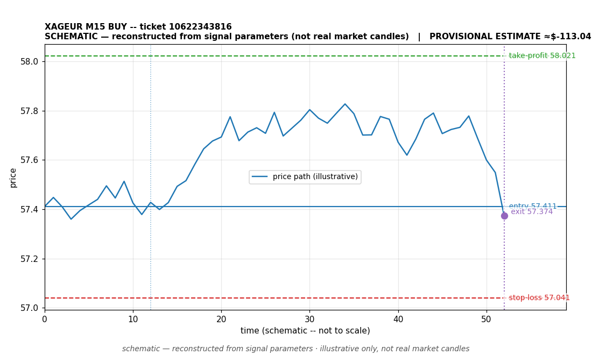

# XAGEUR BUY -- ticket 10622343816

**Status:** CLOSED — PROVISIONAL ESTIMATE (unconfirmed)
**Date:** 2026-09-22 (MT5 server time (UTC+3))

## Trade facts

- Symbol: XAGEUR
- Direction: BUY
- Timeframe: M15
- Entry time: 2026.09.22 17:30:04 (MT5 server time (UTC+3))
- Exit time: 2026.09.22 17:57:49
- Entry price: 57.411
- Exit price: 57.374
- Stop-loss: 57.041
- Take-profit: 58.021
- Volume: 2.67 lots
- P&L: $-113.04 (provisional estimate — excludes commission/swap; NOT broker-confirmed)
- Floating P&L: not recorded
- Commission / swap: commission=0, swap=0
- Exit reason: command — provisional (unconfirmed)
- Market session at entry: London / New York

## Signal rationale

strategy `ema_rsi`: EMA20 crossed above EMA50, RSI=53.0 (RSI=53.0, EMA20=57.313, EMA50=57.31, ATR=0.218, candle: 2026.09.22 17:15:00)

## Gate decision record

decision: `commanded`; volume: 2.67; planned risk: $1,000.00; time: 2026-09-22 07:30:03

## Why this is only a provisional estimate

- This close is a PROVISIONAL ESTIMATE, not a broker-confirmed result. No profit or loss is claimed for this trade; any figure shown is for context only.
- Basis: close reason 'command'.
- Commission/swap: not recorded -- excluded from the estimate.

## Chart

_Chart is schematic -- reconstructed from the signal's entry/SL/TP/exit parameters. No historical candle data is stored in this environment, so this is an illustration of the trade plan, not real market candles._

## Data gaps / notes

- Close is a provisional estimate -- not broker-confirmed; excluded from the realized P&L total.

---
_Generated by trade_report.py for the 30-day autonomous demo trading experiment. Demo account, no real money._
