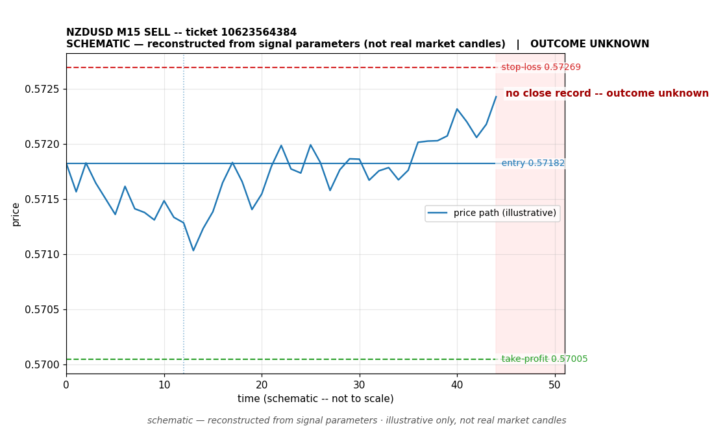

# NZDUSD SELL -- ticket 10623564384

**Status:** OUTCOME UNKNOWN — under reconciliation
**Date:** 2026-09-22 (MT5 server time (UTC+3))

## Trade facts

- Symbol: NZDUSD
- Direction: SELL
- Timeframe: M15
- Entry time: 2026.09.22 18:15:02 (MT5 server time (UTC+3))
- Exit time: not recorded
- Entry price: 0.57182
- Exit price: not recorded
- Stop-loss: 0.57269
- Take-profit: 0.57005
- Volume: 2.27 lots
- P&L: unknown
- Floating P&L: not recorded
- Commission / swap: not recorded
- Exit reason: not recorded
- Market session at entry: London / New York

## Signal rationale

strategy `ema_rsi`: EMA20 crossed below EMA50, RSI=36.9 (RSI=36.9, EMA20=0.57293, EMA50=0.57296, ATR=0.00059, candle: 2026.09.22 18:00:00)

## Gate decision record

decision: `commanded`; volume: 2.27; planned risk: $200.00; time: 2026-09-22 08:15:00

## Why this is unresolved

- Outcome unknown -- no clean close record exists for this ticket. The position is absent from the latest broker open-positions snapshot without a recorded close event. It is under reconciliation; no profit or loss is claimed.

## Chart

_Chart is schematic -- reconstructed from the signal's entry/SL/TP/exit parameters. No historical candle data is stored in this environment, so this is an illustration of the trade plan, not real market candles._

## Data gaps / notes

- No close event recorded -- outcome unknown, under reconciliation.

---
_Generated by trade_report.py for the 30-day autonomous demo trading experiment. Demo account, no real money._
