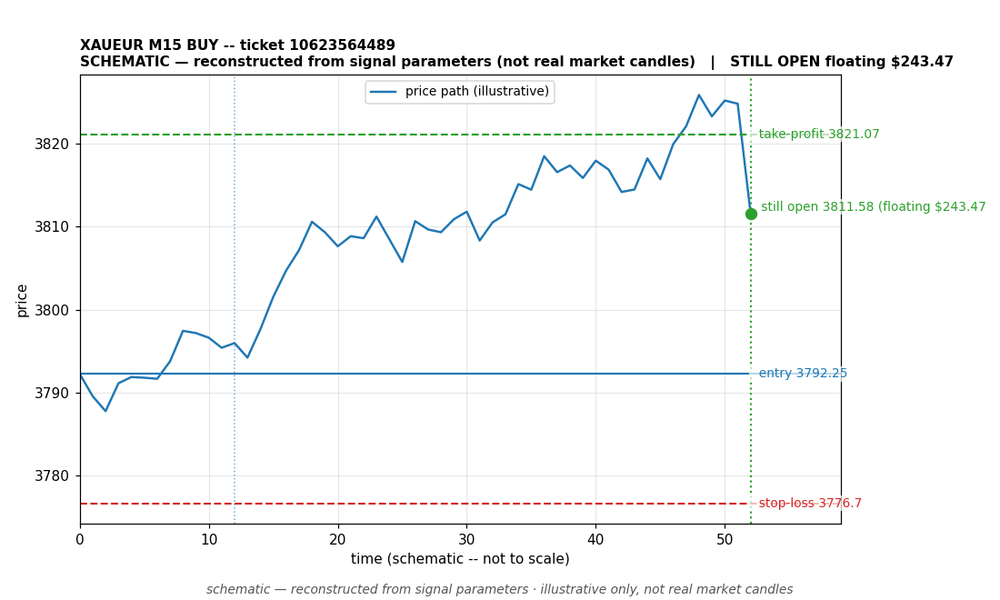

# XAUEUR BUY -- ticket 10623564489

**Status:** OPEN — per latest positions snapshot
**Date:** 2026-09-22 (MT5 server time (UTC+3))

## Trade facts

- Symbol: XAUEUR
- Direction: BUY
- Timeframe: M15
- Entry time: 2026.09.22 18:15:02 (MT5 server time (UTC+3))
- Exit time: still open
- Entry price: 3792.25
- Exit price: not recorded
- Stop-loss: 3776.7
- Take-profit: 3821.07
- Volume: 0.11 lots
- P&L: unknown
- Floating P&L: $243.47 (unrealized, snapshot 2026.09.22 23:28:37)
- Commission / swap: not recorded
- Exit reason: still open
- Market session at entry: London / New York

## Signal rationale

strategy `ema_rsi`: EMA20 crossed above EMA50, RSI=60.0 (RSI=60.0, EMA20=3779.95, EMA50=3779.45, ATR=9.86, candle: 2026.09.22 18:00:00)

## Gate decision record

decision: `commanded`; volume: 0.11; planned risk: $200.00; time: 2026-09-22 08:15:00

## Why this is still open

- Still open: unrealized (floating) P&L of $243.47 at the latest positions snapshot (2026.09.22 23:28:37, MT5 server time (UTC+3)). No profit or loss is banked; the outcome will be documented when a close is recorded.
- Current price 3811.58 vs entry 3792.25; SL 3776.7, TP 3821.07.

## Chart

_Chart is schematic -- reconstructed from the signal's entry/SL/TP/exit parameters. No historical candle data is stored in this environment, so this is an illustration of the trade plan, not real market candles._

## Data gaps / notes

- None -- all key fields recorded.

---
_Generated by trade_report.py for the 30-day autonomous demo trading experiment. Demo account, no real money._
