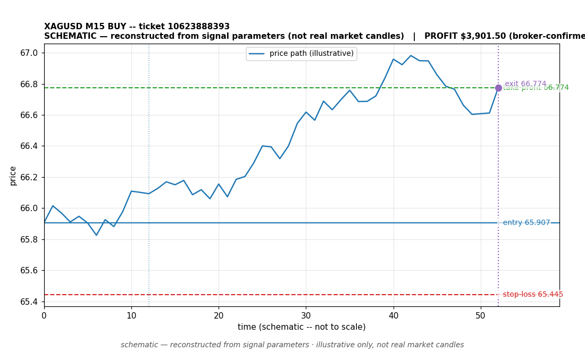

# XAGUSD BUY -- ticket 10623888393

**Status:** CLOSED — PROFIT (broker-confirmed)
**Date:** 2026-09-22 (MT5 server time (UTC+3))

## Trade facts

- Symbol: XAGUSD
- Direction: BUY
- Timeframe: M15
- Entry time: 2026.09.22 18:30:01 (MT5 server time (UTC+3))
- Exit time: 2026.09.22 21:06:14
- Entry price: 65.907
- Exit price: 66.774
- Stop-loss: 65.445
- Take-profit: 66.774
- Volume: 0.9 lots
- P&L: $3,901.50 (broker-confirmed net)
- Floating P&L: not recorded
- Commission / swap: not recorded
- Exit reason: broker-recorded close — broker-confirmed
- Market session at entry: London / New York

## Signal rationale

strategy `ema_rsi`: EMA20 crossed above EMA50, RSI=55.8 (RSI=55.8, EMA20=65.713, EMA50=65.708, ATR=0.295, candle: 2026.09.22 18:15:00)

## Gate decision record

decision: `commanded`; volume: 0.9; planned risk: $200.00; time: 2026-09-22 15:29:59

## Why profit — broker-confirmed

- Broker-confirmed profit: the trade reached its take-profit target (66.774). Exit price 66.774 matches the TP set on the signal, so the broker closed it as a winner.
- It was held 9373 seconds (~156 min) -- a fast move in the signal's direction after entry.
- Commission/swap: not recorded in the close event.

## Chart

_Chart is schematic -- reconstructed from the signal's entry/SL/TP/exit parameters. No historical candle data is stored in this environment, so this is an illustration of the trade plan, not real market candles._

## Data gaps / notes

- broker-side exit detected by EA position watch

---
_Generated by trade_report.py for the 30-day autonomous demo trading experiment. Demo account, no real money._
