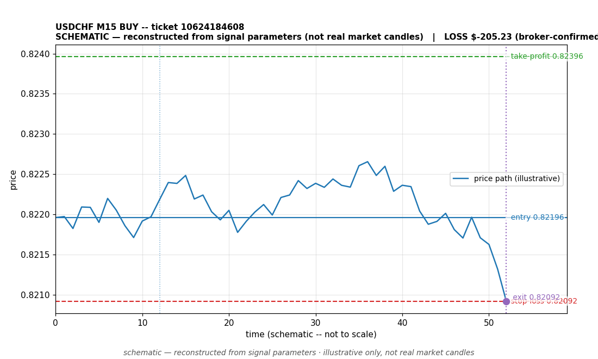

# USDCHF BUY -- ticket 10624184608

**Status:** CLOSED — LOSS (broker-confirmed)
**Date:** 2026-09-22 (MT5 server time (UTC+3))

## Trade facts

- Symbol: USDCHF
- Direction: BUY
- Timeframe: M15
- Entry time: 2026.09.22 18:45:03 (MT5 server time (UTC+3))
- Exit time: 2026.09.22 21:09:26
- Entry price: 0.82196
- Exit price: 0.82092
- Stop-loss: 0.82092
- Take-profit: 0.82396
- Volume: 1.62 lots
- P&L: $-205.23 (broker-confirmed net)
- Floating P&L: not recorded
- Commission / swap: not recorded
- Exit reason: broker-recorded close — broker-confirmed
- Market session at entry: London / New York

## Signal rationale

strategy `ema_rsi`: EMA20 crossed above EMA50, RSI=65.7 (RSI=65.7, EMA20=0.82048, EMA50=0.82042, ATR=0.00068, candle: 2026.09.22 18:30:00)

## Gate decision record

decision: `commanded`; volume: 1.62; planned risk: $200.00; time: 2026-09-22 15:45:01

## Why loss — broker-confirmed

- Broker-confirmed loss: the trade hit its stop-loss (0.82092). Exit price 0.82092 matches the SL, so the position was stopped out as designed by the risk plan.
- Entry 0.82196 -> SL 0.82092: price moved against the buy position immediately; the EMA-cross signal did not follow through.
- Commission/swap: not recorded in the close event.

## Chart

_Chart is schematic -- reconstructed from the signal's entry/SL/TP/exit parameters. No historical candle data is stored in this environment, so this is an illustration of the trade plan, not real market candles._

## Data gaps / notes

- broker-side exit detected by EA position watch

---
_Generated by trade_report.py for the 30-day autonomous demo trading experiment. Demo account, no real money._
