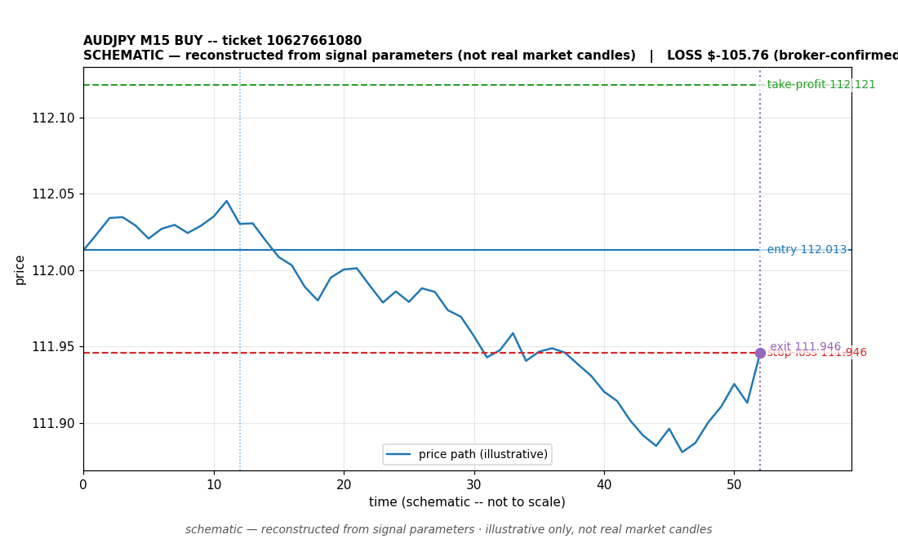

# AUDJPY BUY -- ticket 10627661080

**Status:** CLOSED — LOSS (broker-confirmed)
**Date:** 2026-09-22 (MT5 server time (UTC+3))

## Trade facts

- Symbol: AUDJPY
- Direction: BUY
- Timeframe: M15
- Entry time: 2026.09.22 22:00:04 (MT5 server time (UTC+3))
- Exit time: 2026.09.23 00:01:09
- Entry price: 112.013
- Exit price: 111.946
- Stop-loss: 111.946
- Take-profit: 112.121
- Volume: 2.71 lots
- P&L: $-105.76 (broker-confirmed net)
- Floating P&L: not recorded
- Commission / swap: commission=0, swap=9.64
- Exit reason: broker-recorded close — broker-confirmed
- Market session at entry: New York

## Signal rationale

strategy `ema_rsi`: EMA20 crossed above EMA50, RSI=67.7 (RSI=67.7, EMA20=111.901, EMA50=111.898, ATR=0.039, candle: 2026.09.22 21:45:00)

## Gate decision record

decision: `commanded`; volume: 2.71; planned risk: $100.00; time: 2026-09-22 19:00:02

## Why loss — broker-confirmed

- Broker-confirmed loss: the trade hit its stop-loss (111.946). Exit price 111.946 matches the SL, so the position was stopped out as designed by the risk plan.
- Entry 112.013 -> SL 111.946: price moved against the buy position immediately; the EMA-cross signal did not follow through.
- Commission 0, swap 9.64 (included in the confirmed net figure).

## Chart

_Chart is schematic -- reconstructed from the signal's entry/SL/TP/exit parameters. No historical candle data is stored in this environment, so this is an illustration of the trade plan, not real market candles._

## Data gaps / notes

- None -- all key fields recorded.

---
_Generated by trade_report.py for the 30-day autonomous demo trading experiment. Demo account, no real money._
