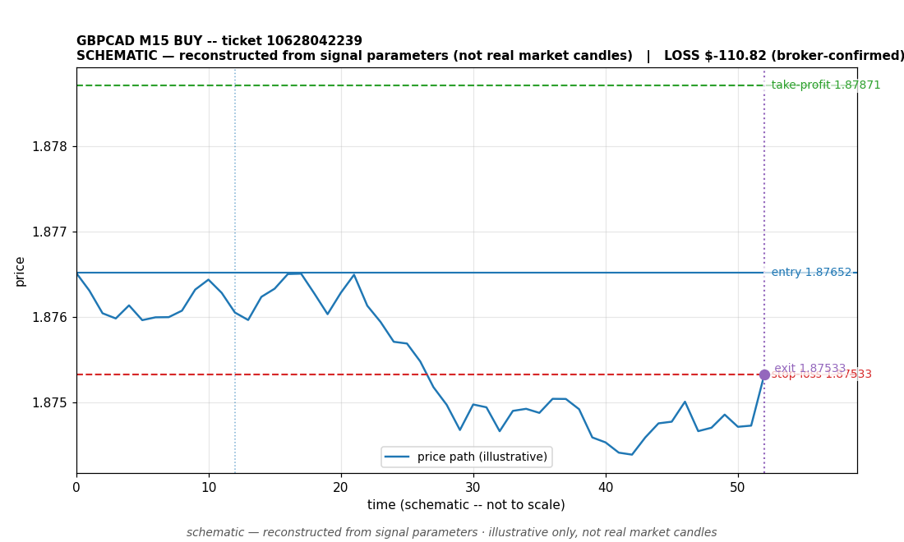

# GBPCAD BUY -- ticket 10628042239

**Status:** CLOSED — LOSS (broker-confirmed)
**Date:** 2026-09-22 (MT5 server time (UTC+3))

## Trade facts

- Symbol: GBPCAD
- Direction: BUY
- Timeframe: M15
- Entry time: 2026.09.22 22:30:04 (MT5 server time (UTC+3))
- Exit time: 2026.09.23 00:00:32
- Entry price: 1.87652
- Exit price: 1.87533
- Stop-loss: 1.87533
- Take-profit: 1.87871
- Volume: 1.24 lots
- P&L: $-110.82 (broker-confirmed net)
- Floating P&L: not recorded
- Commission / swap: commission=0, swap=-5.82
- Exit reason: broker-recorded close — broker-confirmed
- Market session at entry: New York

## Signal rationale

strategy `ema_rsi`: EMA20 crossed above EMA50, RSI=54.0 (RSI=54.0, EMA20=1.87606, EMA50=1.87604, ATR=0.00075, candle: 2026.09.22 22:15:00)

## Gate decision record

decision: `commanded`; volume: 1.24; planned risk: $100.00; time: 2026-09-22 19:30:02

## Why loss — broker-confirmed

- Broker-confirmed loss: the trade hit its stop-loss (1.87533). Exit price 1.87533 matches the SL, so the position was stopped out as designed by the risk plan.
- Entry 1.87652 -> SL 1.87533: price moved against the buy position immediately; the EMA-cross signal did not follow through.
- Commission 0, swap -5.82 (included in the confirmed net figure).

## Chart

_Chart is schematic -- reconstructed from the signal's entry/SL/TP/exit parameters. No historical candle data is stored in this environment, so this is an illustration of the trade plan, not real market candles._

## Data gaps / notes

- None -- all key fields recorded.

---
_Generated by trade_report.py for the 30-day autonomous demo trading experiment. Demo account, no real money._
