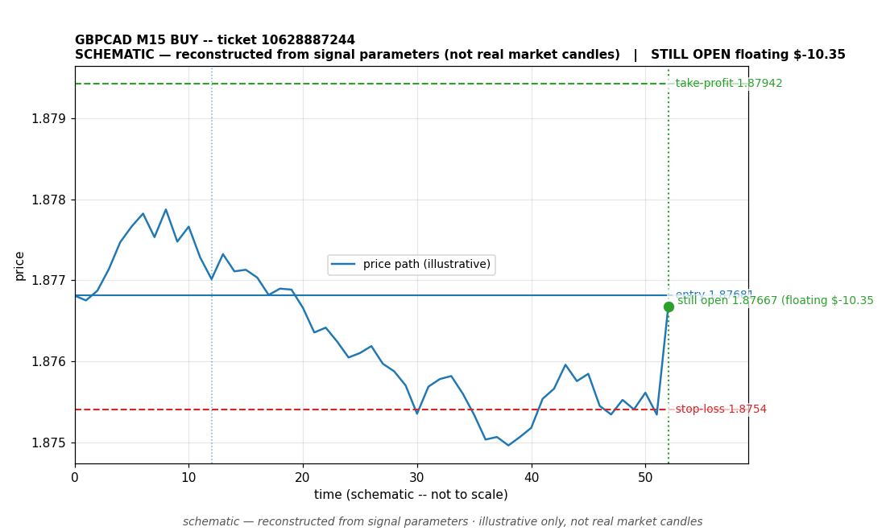

# GBPCAD BUY -- ticket 10628887244

**Status:** OPEN — per latest positions snapshot
**Date:** 2026-09-23 (MT5 server time (UTC+3))

## Trade facts

- Symbol: GBPCAD
- Direction: BUY
- Timeframe: M15
- Entry time: 2026.09.23 01:15:00 (MT5 server time (UTC+3))
- Exit time: still open
- Entry price: 1.87681
- Exit price: not recorded
- Stop-loss: 1.8754
- Take-profit: 1.87942
- Volume: 1.04 lots
- P&L: unknown
- Floating P&L: $-10.35 (unrealized, snapshot 2026.09.22 23:28:37)
- Commission / swap: not recorded
- Exit reason: still open
- Market session at entry: Asian (Sydney/Tokyo)

## Signal rationale

strategy `ema_rsi`: EMA20 crossed above EMA50, RSI=54.7 (RSI=54.7, EMA20=1.87615, EMA50=1.87611, ATR=0.00089, candle: 2026.09.23 01:00:00)

## Gate decision record

decision: `commanded`; volume: 1.04; planned risk: $100.00; time: 2026-09-22 22:15:00

## Why this is still open

- Still open: unrealized (floating) P&L of $-10.35 at the latest positions snapshot (2026.09.22 23:28:37, MT5 server time (UTC+3)). No profit or loss is banked; the outcome will be documented when a close is recorded.
- Current price 1.87667 vs entry 1.87681; SL 1.8754, TP 1.87942.

## Chart

_Chart is schematic -- reconstructed from the signal's entry/SL/TP/exit parameters. No historical candle data is stored in this environment, so this is an illustration of the trade plan, not real market candles._

## Data gaps / notes

- None -- all key fields recorded.

---
_Generated by trade_report.py for the 30-day autonomous demo trading experiment. Demo account, no real money._
