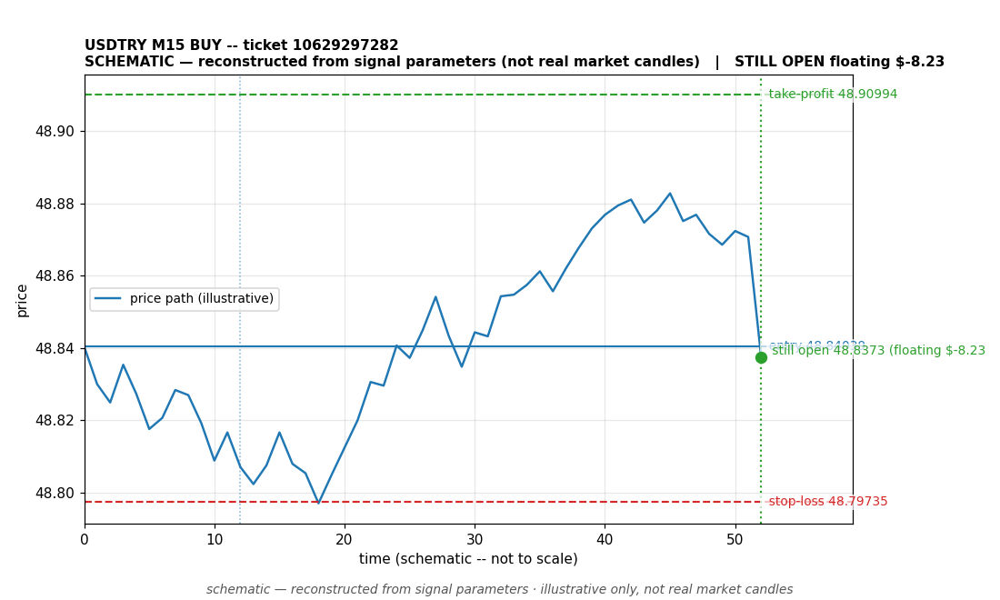

# USDTRY BUY -- ticket 10629297282

**Status:** OPEN — per latest positions snapshot
**Date:** 2026-09-23 (MT5 server time (UTC+3))

## Trade facts

- Symbol: USDTRY
- Direction: BUY
- Timeframe: M15
- Entry time: 2026.09.23 02:47:33 (MT5 server time (UTC+3))
- Exit time: still open
- Entry price: 48.84039
- Exit price: not recorded
- Stop-loss: 48.79735
- Take-profit: 48.90994
- Volume: 1.3 lots
- P&L: unknown
- Floating P&L: $-8.23 (unrealized, snapshot 2026.09.23 15:08:22)
- Commission / swap: not recorded
- Exit reason: still open
- Market session at entry: Asian (Sydney/Tokyo)

## Signal rationale

strategy `ema_rsi`: EMA20 crossed above EMA50, RSI=62.6 (RSI=62.6, EMA20=48.81458, EMA50=48.81384, ATR=0.02502, candle: 2026.09.23 02:15:00)

## Gate decision record

decision: `commanded`; volume: 1.3; planned risk: $100.00; time: 2026-09-22 16:47:31

## Why this is still open

- Still open: unrealized (floating) P&L of $-8.23 at the latest positions snapshot (2026.09.23 15:08:22, MT5 server time (UTC+3)). No profit or loss is banked; the outcome will be documented when a close is recorded.
- Current price 48.8373 vs entry 48.84039; SL 48.79735, TP 48.90994.

## Chart

_Chart is schematic -- reconstructed from the signal's entry/SL/TP/exit parameters. No historical candle data is stored in this environment, so this is an illustration of the trade plan, not real market candles._

## Data gaps / notes

- None -- all key fields recorded.

---
_Generated by trade_report.py for the 30-day autonomous demo trading experiment. Demo account, no real money._
