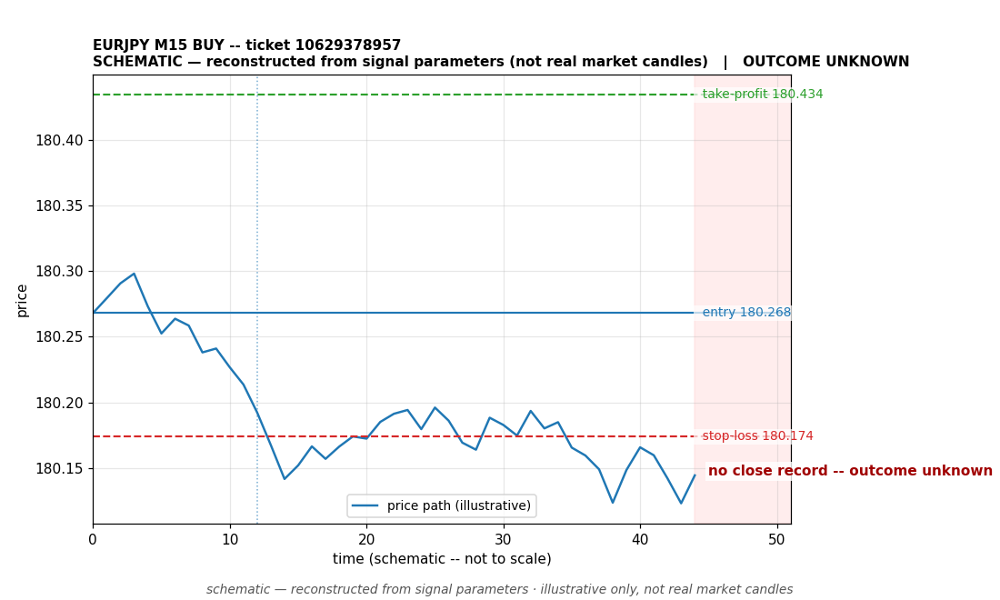

# EURJPY BUY -- ticket 10629378957

**Status:** OUTCOME UNKNOWN — under reconciliation
**Date:** 2026-09-23 (MT5 server time (UTC+3))

## Trade facts

- Symbol: EURJPY
- Direction: BUY
- Timeframe: M15
- Entry time: 2026.09.23 03:00:02 (MT5 server time (UTC+3))
- Exit time: not recorded
- Entry price: 180.268
- Exit price: not recorded
- Stop-loss: 180.174
- Take-profit: 180.434
- Volume: 1.8 lots
- P&L: unknown
- Floating P&L: not recorded
- Commission / swap: not recorded
- Exit reason: not recorded
- Market session at entry: Asian (Sydney/Tokyo) / Tokyo

## Signal rationale

strategy `ema_rsi`: EMA20 crossed above EMA50, RSI=60.5 (RSI=60.5, EMA20=180.21, EMA50=180.209, ATR=0.058, candle: 2026.09.23 02:45:00)

## Gate decision record

decision: `commanded`; volume: 1.8; planned risk: $100.00; time: 2026-09-23 00:00:01

## Why this is unresolved

- No close recorded yet -- this trade opened after the latest positions snapshot, so its current open/closed status is unconfirmed. Nothing is claimed about its outcome.

## Chart

_Chart is schematic -- reconstructed from the signal's entry/SL/TP/exit parameters. No historical candle data is stored in this environment, so this is an illustration of the trade plan, not real market candles._

## Data gaps / notes

- No close event recorded -- outcome unknown, under reconciliation.

---
_Generated by trade_report.py for the 30-day autonomous demo trading experiment. Demo account, no real money._
