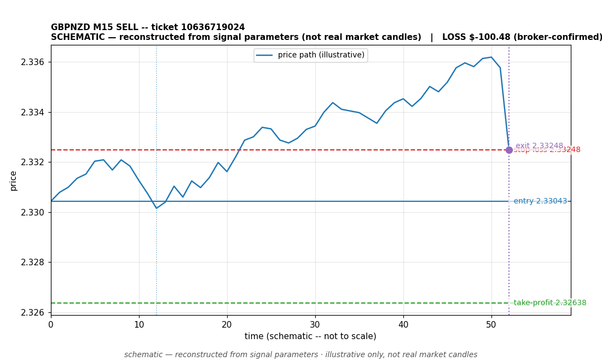

# GBPNZD SELL -- ticket 10636719024

**Status:** CLOSED — LOSS (broker-confirmed)
**Date:** 2026-09-23 (MT5 server time (UTC+3))

## Trade facts

- Symbol: GBPNZD
- Direction: SELL
- Timeframe: M15
- Entry time: 2026.09.23 13:00:12 (MT5 server time (UTC+3))
- Exit time: 2026.09.23 14:13:05
- Entry price: 2.33043
- Exit price: 2.33248
- Stop-loss: 2.33248
- Take-profit: 2.32638
- Volume: 0.86 lots
- P&L: $-100.48 (broker-confirmed net)
- Floating P&L: not recorded
- Commission / swap: not recorded
- Exit reason: broker-recorded close — broker-confirmed
- Market session at entry: London

## Signal rationale

strategy `ema_rsi`: EMA20 crossed below EMA50, RSI=36.4 (RSI=36.4, EMA20=2.33264, EMA50=2.33269, ATR=0.00136, candle: 2026.09.23 12:45:00)

## Gate decision record

decision: `commanded`; volume: 0.86; planned risk: $100.00; time: 2026-09-23 10:00:00

## Why loss — broker-confirmed

- Broker-confirmed loss: the trade hit its stop-loss (2.33248). Exit price 2.33248 matches the SL, so the position was stopped out as designed by the risk plan.
- Entry 2.33043 -> SL 2.33248: price moved against the sell position immediately; the EMA-cross signal did not follow through.
- Commission/swap: not recorded in the close event.

## Chart

_Chart is schematic -- reconstructed from the signal's entry/SL/TP/exit parameters. No historical candle data is stored in this environment, so this is an illustration of the trade plan, not real market candles._

## Data gaps / notes

- broker-side exit detected by EA position watch

---
_Generated by trade_report.py for the 30-day autonomous demo trading experiment. Demo account, no real money._
