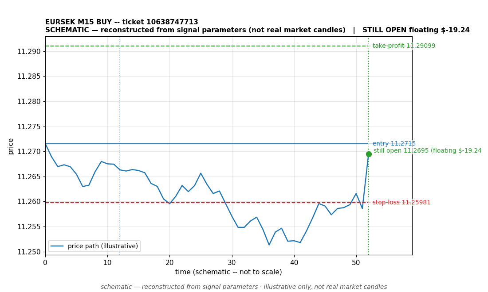

# EURSEK BUY -- ticket 10638747713

**Status:** OPEN — per latest positions snapshot
**Date:** 2026-09-23 (MT5 server time (UTC+3))

## Trade facts

- Symbol: EURSEK
- Direction: BUY
- Timeframe: M15
- Entry time: 2026.09.23 14:45:04 (MT5 server time (UTC+3))
- Exit time: still open
- Entry price: 11.2715
- Exit price: not recorded
- Stop-loss: 11.25981
- Take-profit: 11.29099
- Volume: 0.95 lots
- P&L: unknown
- Floating P&L: $-19.24 (unrealized, snapshot 2026.09.23 15:08:22)
- Commission / swap: not recorded
- Exit reason: still open
- Market session at entry: London

## Signal rationale

strategy `ema_rsi`: EMA20 crossed above EMA50, RSI=62.1 (RSI=62.1, EMA20=11.26043, EMA50=11.25989, ATR=0.00693, candle: 2026.09.23 14:30:00)

## Gate decision record

decision: `commanded`; volume: 0.95; planned risk: $100.00; time: 2026-09-23 11:45:03

## Why this is still open

- Still open: unrealized (floating) P&L of $-19.24 at the latest positions snapshot (2026.09.23 15:08:22, MT5 server time (UTC+3)). No profit or loss is banked; the outcome will be documented when a close is recorded.
- Current price 11.2695 vs entry 11.2715; SL 11.25981, TP 11.29099.

## Chart

_Chart is schematic -- reconstructed from the signal's entry/SL/TP/exit parameters. No historical candle data is stored in this environment, so this is an illustration of the trade plan, not real market candles._

## Data gaps / notes

- None -- all key fields recorded.

---
_Generated by trade_report.py for the 30-day autonomous demo trading experiment. Demo account, no real money._
