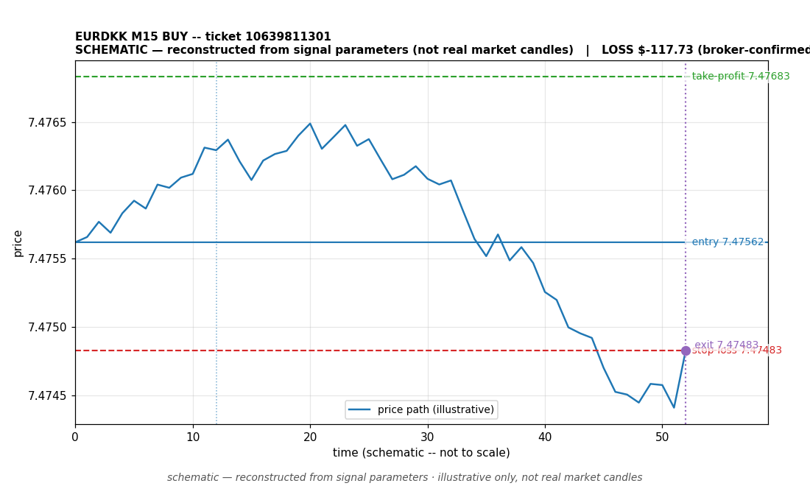

# EURDKK BUY -- ticket 10639811301

**Status:** CLOSED — LOSS (broker-confirmed)
**Date:** 2026-09-23 (MT5 server time (UTC+3))

## Trade facts

- Symbol: EURDKK
- Direction: BUY
- Timeframe: M15
- Entry time: 2026.09.23 15:30:01 (MT5 server time (UTC+3))
- Exit time: 2026.09.23 15:33:14
- Entry price: 7.47562
- Exit price: 7.47483
- Stop-loss: 7.47483
- Take-profit: 7.47683
- Volume: 9.77 lots
- P&L: $-117.73 (broker-confirmed net)
- Floating P&L: not recorded
- Commission / swap: not recorded
- Exit reason: broker-recorded close — broker-confirmed
- Market session at entry: London / New York

## Signal rationale

strategy `ema_rsi`: EMA20 crossed above EMA50, RSI=64.1 (RSI=64.1, EMA20=7.47537, EMA50=7.47537, ATR=0.00044, candle: 2026.09.23 15:15:00)

## Gate decision record

decision: `commanded`; volume: 9.78; planned risk: $100.00; time: 2026-09-23 12:30:01

## Why loss — broker-confirmed

- Broker-confirmed loss: the trade hit its stop-loss (7.47483). Exit price 7.47483 matches the SL, so the position was stopped out as designed by the risk plan.
- Entry 7.47562 -> SL 7.47483: price moved against the buy position immediately; the EMA-cross signal did not follow through.
- Commission/swap: not recorded in the close event.

## Chart

_Chart is schematic -- reconstructed from the signal's entry/SL/TP/exit parameters. No historical candle data is stored in this environment, so this is an illustration of the trade plan, not real market candles._

## Data gaps / notes

- broker-side exit detected by EA position watch

---
_Generated by trade_report.py for the 30-day autonomous demo trading experiment. Demo account, no real money._
