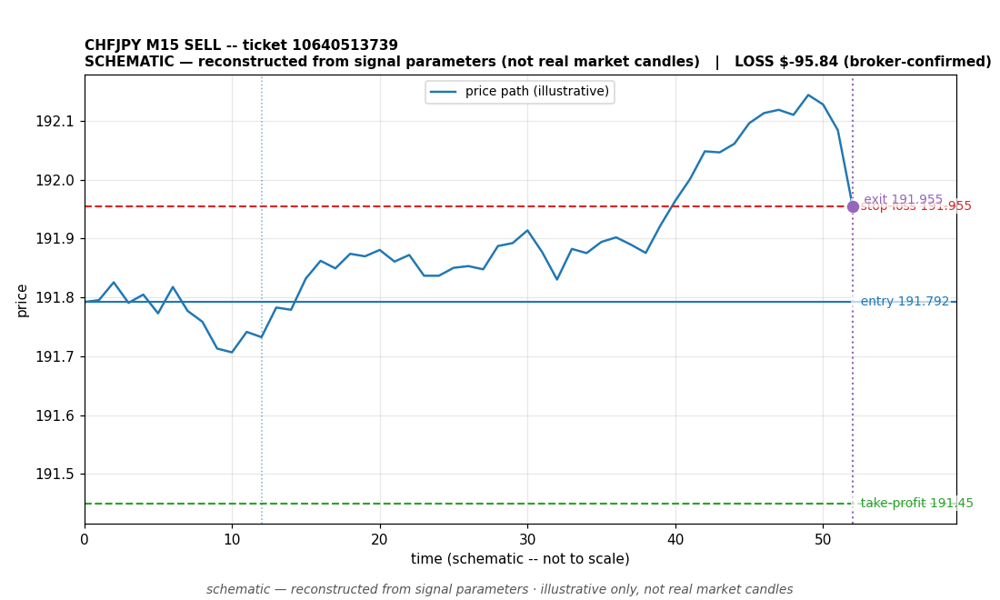

# CHFJPY SELL -- ticket 10640513739

**Status:** CLOSED — LOSS (broker-confirmed)
**Date:** 2026-09-23 (MT5 server time (UTC+3))

## Trade facts

- Symbol: CHFJPY
- Direction: SELL
- Timeframe: M15
- Entry time: 2026.09.23 16:00:03 (MT5 server time (UTC+3))
- Exit time: 2026.09.23 17:10:52
- Entry price: 191.792
- Exit price: 191.955
- Stop-loss: 191.955
- Take-profit: 191.45
- Volume: 0.93 lots
- P&L: $-95.84 (broker-confirmed net)
- Floating P&L: not recorded
- Commission / swap: not recorded
- Exit reason: broker-recorded close — broker-confirmed
- Market session at entry: London / New York

## Signal rationale

strategy `ema_rsi`: EMA20 crossed below EMA50, RSI=45.5 (RSI=45.5, EMA20=191.848, EMA50=191.849, ATR=0.112, candle: 2026.09.23 15:45:00)

## Gate decision record

decision: `commanded`; volume: 0.93; planned risk: $100.00; time: 2026-09-23 13:00:03

## Why loss — broker-confirmed

- Broker-confirmed loss: the trade hit its stop-loss (191.955). Exit price 191.955 matches the SL, so the position was stopped out as designed by the risk plan.
- Entry 191.792 -> SL 191.955: price moved against the sell position immediately; the EMA-cross signal did not follow through.
- Commission/swap: not recorded in the close event.

## Chart

_Chart is schematic -- reconstructed from the signal's entry/SL/TP/exit parameters. No historical candle data is stored in this environment, so this is an illustration of the trade plan, not real market candles._

## Data gaps / notes

- broker-side exit detected by EA position watch

---
_Generated by trade_report.py for the 30-day autonomous demo trading experiment. Demo account, no real money._
