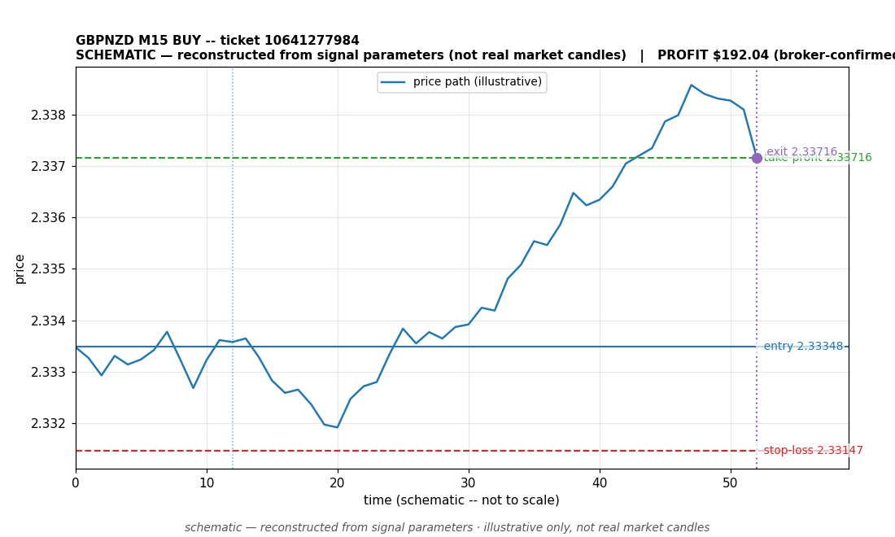

# GBPNZD BUY -- ticket 10641277984

**Status:** CLOSED — PROFIT (broker-confirmed)
**Date:** 2026-09-23 (MT5 server time (UTC+3))

## Trade facts

- Symbol: GBPNZD
- Direction: BUY
- Timeframe: M15
- Entry time: 2026.09.23 16:30:01 (MT5 server time (UTC+3))
- Exit time: 2026.09.23 16:52:13
- Entry price: 2.33348
- Exit price: 2.33716
- Stop-loss: 2.33147
- Take-profit: 2.33716
- Volume: 0.92 lots
- P&L: $192.04 (broker-confirmed net)
- Floating P&L: not recorded
- Commission / swap: not recorded
- Exit reason: broker-recorded close — broker-confirmed
- Market session at entry: London / New York

## Signal rationale

strategy `ema_rsi`: EMA20 crossed above EMA50, RSI=55.4 (RSI=55.4, EMA20=2.3325, EMA50=2.33249, ATR=0.00126, candle: 2026.09.23 16:15:00)

## Gate decision record

decision: `commanded`; volume: 0.92; planned risk: $100.00; time: 2026-09-23 13:30:01

## Why profit — broker-confirmed

- Broker-confirmed profit: the trade reached its take-profit target (2.33716). Exit price 2.33716 matches the TP set on the signal, so the broker closed it as a winner.
- It was held 1332 seconds (~22 min) -- a fast move in the signal's direction after entry.
- Commission/swap: not recorded in the close event.

## Chart

_Chart is schematic -- reconstructed from the signal's entry/SL/TP/exit parameters. No historical candle data is stored in this environment, so this is an illustration of the trade plan, not real market candles._

## Data gaps / notes

- broker-side exit detected by EA position watch

---
_Generated by trade_report.py for the 30-day autonomous demo trading experiment. Demo account, no real money._
