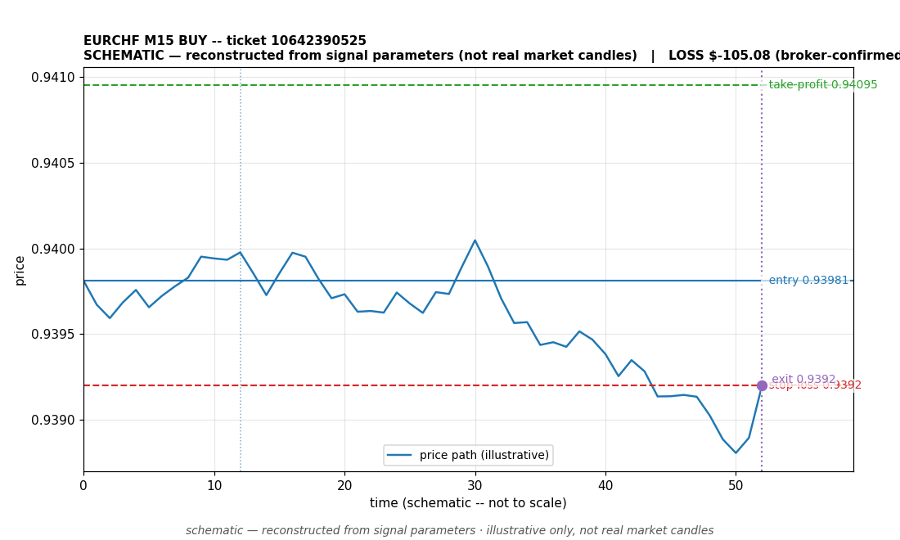

# EURCHF BUY -- ticket 10642390525

**Status:** CLOSED — LOSS (broker-confirmed)
**Date:** 2026-09-23 (MT5 server time (UTC+3))

## Trade facts

- Symbol: EURCHF
- Direction: BUY
- Timeframe: M15
- Entry time: 2026.09.23 17:00:00 (MT5 server time (UTC+3))
- Exit time: 2026.09.23 17:37:37
- Entry price: 0.93981
- Exit price: 0.9392
- Stop-loss: 0.9392
- Take-profit: 0.94095
- Volume: 1.42 lots
- P&L: $-105.08 (broker-confirmed net)
- Floating P&L: not recorded
- Commission / swap: not recorded
- Exit reason: broker-recorded close — broker-confirmed
- Market session at entry: London / New York

## Signal rationale

strategy `ema_rsi`: EMA20 crossed above EMA50, RSI=63.5 (RSI=63.5, EMA20=0.93916, EMA50=0.93915, ATR=0.00039, candle: 2026.09.23 16:45:00)

## Gate decision record

decision: `commanded`; volume: 1.42; planned risk: $100.00; time: 2026-09-23 14:00:00

## Why loss — broker-confirmed

- Broker-confirmed loss: the trade hit its stop-loss (0.9392). Exit price 0.9392 matches the SL, so the position was stopped out as designed by the risk plan.
- Entry 0.93981 -> SL 0.9392: price moved against the buy position immediately; the EMA-cross signal did not follow through.
- Commission/swap: not recorded in the close event.

## Chart

_Chart is schematic -- reconstructed from the signal's entry/SL/TP/exit parameters. No historical candle data is stored in this environment, so this is an illustration of the trade plan, not real market candles._

## Data gaps / notes

- broker-side exit detected by EA position watch

---
_Generated by trade_report.py for the 30-day autonomous demo trading experiment. Demo account, no real money._
