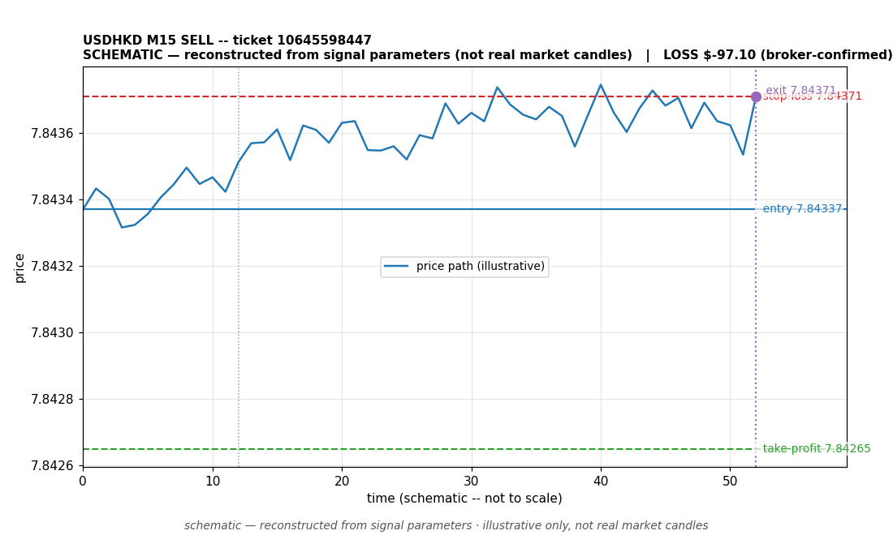

# USDHKD SELL -- ticket 10645598447

**Status:** CLOSED — LOSS (broker-confirmed)
**Date:** 2026-09-23 (MT5 server time (UTC+3))

## Trade facts

- Symbol: USDHKD
- Direction: SELL
- Timeframe: M15
- Entry time: 2026.09.23 19:15:05 (MT5 server time (UTC+3))
- Exit time: 2026.09.23 21:12:29
- Entry price: 7.84337
- Exit price: 7.84371
- Stop-loss: 7.84371
- Take-profit: 7.84265
- Volume: 22.4 lots
- P&L: $-97.10 (broker-confirmed net)
- Floating P&L: not recorded
- Commission / swap: not recorded
- Exit reason: broker-recorded close — broker-confirmed
- Market session at entry: New York

## Signal rationale

strategy `ema_rsi`: EMA20 crossed below EMA50, RSI=48.7 (RSI=48.7, EMA20=7.84341, EMA50=7.84341, ATR=0.00023, candle: 2026.09.23 19:00:00)

## Gate decision record

decision: `commanded`; volume: 22.4; planned risk: $100.00; time: 2026-09-23 16:15:03

## Why loss — broker-confirmed

- Broker-confirmed loss: the trade hit its stop-loss (7.84371). Exit price 7.84371 matches the SL, so the position was stopped out as designed by the risk plan.
- Entry 7.84337 -> SL 7.84371: price moved against the sell position immediately; the EMA-cross signal did not follow through.
- Commission/swap: not recorded in the close event.

## Chart

_Chart is schematic -- reconstructed from the signal's entry/SL/TP/exit parameters. No historical candle data is stored in this environment, so this is an illustration of the trade plan, not real market candles._

## Data gaps / notes

- broker-side exit detected by EA position watch

---
_Generated by trade_report.py for the 30-day autonomous demo trading experiment. Demo account, no real money._
